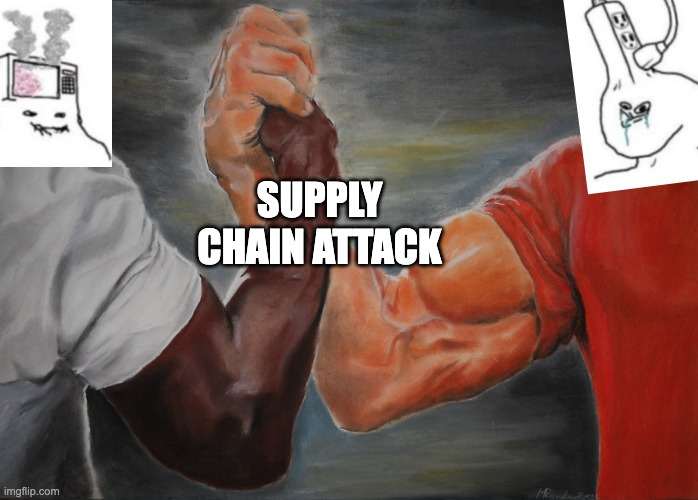

# ZT-Slop



> All it takes is one sloperator trusting another sloperator.
>
> Try ZT-Slop: a simple zero-trust PR check for obvious signs of supply-chain exfil.

ZT-Slop scans what a pull request introduces: dependency changes, lockfile changes, GitHub Actions workflow changes, possible leaked secrets, and obvious secret-exfiltration paths. It is intentionally boring: it does **not** install dependencies, import project code, run tests, execute build scripts, or ask an LLM whether a PR is safe.

## Quick start

Create `.github/workflows/zt-slop.yml` in the repository you want to protect:

```yaml
name: ZT-Slop

on:
  pull_request:
    types: [opened, synchronize, reopened]

permissions:
  contents: read

jobs:
  scan:
    runs-on: ubuntu-latest
    steps:
      - uses: actions/checkout@v4
        with:
          fetch-depth: 0
          persist-credentials: false

      - uses: Joshwani/zt-slop@v0
        with:
          fail-on: block
```

For local testing:

```bash
python3 zt_slop.py --base origin/main --head HEAD --no-network
```

## What it blocks in v0

ZT-Slop starts small and high-signal. The default `block` rules are:

| Area | Example finding |
|---|---|
| Known malicious package | Newly introduced npm/PyPI package version matches an OSV malicious-package advisory |
| Lockfile source drift | Lockfile adds `http://`, `git+ssh`, `file:`, or a URL outside allowed registries |
| GitHub Actions privilege drift | Workflow adds `pull_request_target` or `permissions: write-all` |
| Secret exfil path | Changed file reads secrets/env and sends data to the network |
| Install-time execution | `package.json` adds/changes `preinstall`, `install`, `postinstall`, or `prepare` |
| Obvious secret leak | PR adds a private key, GitHub token, AWS access key, Slack token, or npm token pattern |

It also emits warnings for unpinned GitHub Actions, newly added publishing commands, floating dependency specs like `latest`, removed lockfile integrity metadata, and known non-malicious OSV vulnerability matches.

## Design principles

1. **Diff-first:** old problems should not block a new PR unless the PR made them worse.
2. **No PR code execution:** the scanner only parses files and diffs.
3. **Evidence over vibes:** every finding includes rule ID, location, evidence, and a suggested fix.
4. **No LLM merge gate:** AI may summarize findings later, but blocking decisions should be deterministic.
5. **Tiny dependency footprint:** the scanner uses only the Python standard library.

## Outputs

Each run writes:

```text
zt-slop-report.json
zt-slop-report.md
zt-slop-report.sarif
```

The GitHub Action also writes the Markdown report to the job summary and emits GitHub annotations for block/warn findings.

## Configuration

Optional `zt-slop.json`:

```json
{
  "allowed_registry_domains": [
    "registry.npmjs.org",
    "registry.yarnpkg.com",
    "pypi.org",
    "files.pythonhosted.org"
  ],
  "osv": {
    "enabled": true,
    "warn_on_vulnerabilities": true,
    "timeout_seconds": 12
  },
  "workflow": {
    "warn_on_unpinned_actions": true
  }
}
```

Disable network access if you only want static diff checks:

```yaml
- uses: Joshwani/zt-slop@v0
  with:
    no-network: 'true'
```

## Optional SARIF upload

```yaml
      - uses: Joshwani/zt-slop@v0
        id: zt-slop
        with:
          fail-on: none

      - uses: github/codeql-action/upload-sarif@v3
        if: always()
        with:
          sarif_file: ${{ steps.zt-slop.outputs.report-sarif }}
```

## Example finding

```text
[BLOCK] workflow.pull_request_target .github/workflows/release.yml:4
Workflow adds pull_request_target
Evidence: A PR changed a workflow to use pull_request_target, which runs in the base repository context.
Fix: Use pull_request for untrusted PR code, or split privileged work into a separate trusted workflow.
```

## Scope

This is a starter repo, not a complete supply-chain security program. It is meant to be a practical merge-time tripwire that catches high-confidence PR-introduced risk before a maintainer clicks **Merge**.
